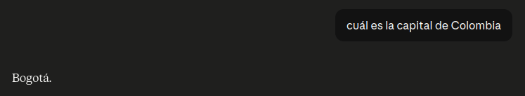
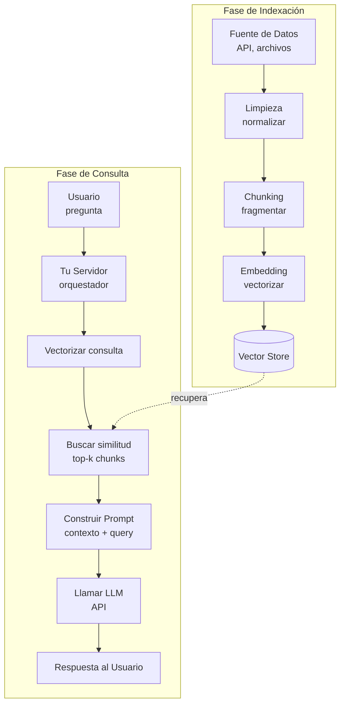
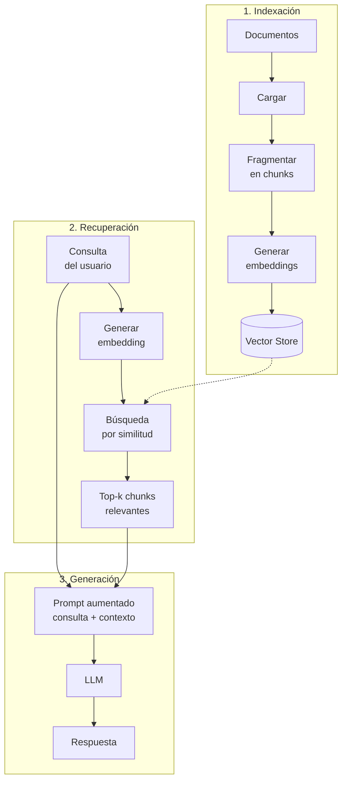

Supongamos que trabajas en una industria regulada, como Medicina. Partiendo de esa premisa, es muy importante que el resultado de una consulta a un sistema utilizando un LLM (Modelo de Lenguaje Grande) tenga los detalles específicos del dominio en su contexto. En otras palabras, queremos aumentar el prompt en sí. ¿Y por qué? Pues los LLMs son entrenados con un corpus finito y con una fecha de corte. Si los requisitos del sistema dependen de información privada (récords médicos, documentos internos, historiales de chat internos, documentos legales, etc.), el modelo simplemente nunca la vio y la calidad de la respuesta comienza a degradar.

Por eso es que preguntar cuál es la capital de Colombia nos da una respuesta correcta.

Pero preguntar cómo se llamaba mi primera mascota no tanto.

Pero no estamos limitados a los datos de entrenamiento, hay varias técnicas para mejorar la calidad de respuesta. Una de ellas, y el tema principal de esta serie, es RAG (Retrieval Augmented Generation o Generación Aumentada por Recuperación). Elaboraré específicamente sobre naive RAG (RAG ingenuo). Es la versión más básica, sin re-ranking, sin reescritura de consulta, sin filtros adicionales. Buena base para entender la mecánica antes de meterle complejidad.

## ¿Qué es RAG (Generación Aumentada por Recuperación)?

Es una técnica donde consultamos una base de datos vectorial para inyectar fragmentos relevantes (con información específica relacionada con la consulta en cuestión) al contexto del prompt. Es una operación opaca para el LLM. Es decir, no sabe de los detalles de implementación del RAG, sencillamente recibe la consulta original del usuario más la información obtenida del almacenamiento vectorial. 

¿Y por qué una fuente de almacenamiento vectorial y no texto o de pronto una base de datos relacional? Tiene que ver con la naturaleza de cómo los computadores tratan la información. Sí, uno podría hacer una búsqueda de palabra clave (keyword search), en la cual utilizamos búsqueda de patrones para obtener resultados... pero es una técnica que no toma en cuenta intención, contexto o significado... es decir, no establece relaciones entre la consulta y el resultado. Sencillamente dice, en esta fuente de datos o corpus, cuáles registros contienen la frase de la búsqueda. Con búsqueda semántica, uno logra convertir texto en vectores numéricos que pueden expresar relaciones entre frases en el texto (por ejemplo anular el contrato y cancelar el acuerdo, etc.).

Es importante resaltar que tenemos que preparar la fuente de datos antes de pasar por el proceso de vector embedding. Hay dos cosas que hacer aquí. Por un lado limpieza (codificación, espacios, quitar boilerplate). Por otro, cuando los datos vienen estructurados, construir documentos en lenguaje natural a partir de ellos. Los embeddings rinden mucho mejor con texto coherente que con registros crudos de una base de datos o filas de un CSV. Así que uno coge cada registro y lo acomoda de tal manera que terminemos con un bloque de texto estándar y ahí se crea el documento en sí.

Bueno, suficientemente sencillo con algo como un catálogo de películas en el cual cada registro solo maneja un título, director, género, año, rating, etc... terminaríamos con un documento relativamente pequeño. Pero, ¿qué pasaría si estamos hablando de algo más grande, como regulaciones o constitución de ley? Ahí terminaríamos con una unidad atómica de contexto que de pronto desperdicie los tokens que tenemos en la sesión (un recurso limitado) o se pierda la relevancia (algo común cuando se aproxima el límite superior de la sesión). Así que chunking o fragmentación alivia este problema. El documento se divide utilizando una estrategia lógica que parte en un tamaño predeterminado, o teniendo en cuenta límites de oración, párrafo, semántica o estructura.

Ya teniendo los fragmentos el sistema puede llamar un API de embedding que básicamente transforma el fragmento y genera un vector (una lista de números e.g. [0.23, -0.7743,... ]), típicamente dimensiones de 384 a 3,072. La magia es que dos fragmentos con significados similares producen vectores cercanos entre sí en el espacio vectorial, aunque no compartan ni una sola palabra. El sistema mide esa cercanía (con similitud coseno, por ejemplo) y así encuentra contenido relacionado por significado, no por coincidencia textual.

Ya teniendo los embeddings vectoriales, necesitamos almacenarlos en un lugar donde podamos hacer una consulta vectorial y recuperar los top-k vectores que semánticamente tienen relación con la consulta. Por lo general se almacena el vector, el fragmento original (representado como texto) y metadata. Ya teniendo todo indexado, uno puede procesar una consulta de parte del usuario en lenguaje natural, convertir esa consulta en un vector utilizando el mismo modelo que utilizamos en la fase de indexación e inyectar los resultados como contexto en el prompt que pasamos al LLM. 

Desglosemos el acrónimo.

- **Recuperación** -> traer información relacionada a la consulta
- **Aumento** -> agregar ese contexto recuperado al prompt
- **Generación** -> el LLM produciendo un resultado con el prompt ya aumentado

## La arquitectura del sistema

Hay dos fases prácticas. En la fase de **indexación** preparamos los datos. Tomamos la fuente, la limpiamos, la fragmentamos en chunks, generamos embeddings (vectores) y los guardamos en una base de datos vectorial. La fase de **consulta** ocurre cuando un usuario hace una pregunta. La convertimos en embedding, buscamos los chunks más similares en el almacenamiento, los inyectamos al prompt junto con la consulta original, y se lo pasamos al LLM.

La literatura y el material educativo suelen descomponer esto un poco más, en tres etapas canónicas... indexación, recuperación y generación. Es la misma idea, solo que la fase de consulta se parte en dos.

- **Indexación** es lo mismo que arriba. Cargamos documentos, los fragmentamos, los vectorizamos y los guardamos. Se hace una sola vez (o periódicamente cuando los datos cambian).
- **Recuperación** es la búsqueda en sí. Tomamos la consulta del usuario, la convertimos en embedding y traemos los chunks más relevantes del almacenamiento vectorial.
- **Generación** es donde el LLM entra en escena. Aquí ocurre el *aumento* que mencionamos antes. Construimos el prompt aumentado (consulta original + contexto recuperado) y el modelo produce la respuesta.
